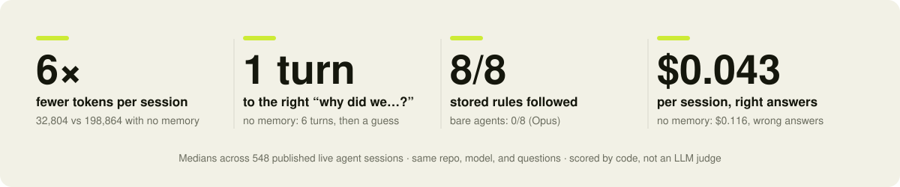

<p align="center">
  <a href="https://contexer.ai">
    <picture>
      <source media="(prefers-color-scheme: dark)" srcset="assets/logo-dark.svg">
      <source media="(prefers-color-scheme: light)" srcset="assets/logo-light.svg">
      
    </picture>
  </a>
</p>

<p align="center">
  <em>The decision and enforcement layer for AI coding agents.</em>
</p>

<p align="center">
  <a href="https://pypi.org/project/contexer/"></a>
  <a href="LICENSE"></a>
  <a href="https://www.python.org/"></a>
  <a href="https://github.com/bhargavamin/contexer/stargazers"></a>
  <a href="https://discord.gg/Fk6JSaW4p"></a>
</p>

<p align="center">
  <a href="#quick-start">Quick start</a> ·
  <a href="#not-another-memory-tool">Why not memory tools?</a> ·
  <a href="#what-contexer-gives-you-that-a-md-file-cant">Why not rule files?</a> ·
  <a href="#how-it-works">How it works</a> ·
  <a href="#enforcement--guardrails">Enforcement</a> ·
  <a href="#see-every-decision-with-its-evidence">Console</a> ·
  <a href="docs/benchmark.md">Benchmark</a> ·
  <a href="#documentation">Docs</a> ·
  <a href="https://discord.gg/Fk6JSaW4p">Discord</a>
</p>

<p align="center">
  <sub><strong>New:</strong> <a href="https://contexer.ai/teams">Contexer Personal Cloud &amp; Teams</a>: sync decisions across machines, share a team decision layer.</sub>
</p>

---

# Train your AI agents to work exactly how you want. And enforce it.

If you work with AI agents every day, you already know these:

- *"My agent ignores my instructions the moment the context window fills up, and I'm back to re-explaining what it must never do."*
- *"I switched to a new agent and every rule and decision I'd built up stayed behind with the old one."*
- *"I run a whole stack of AI tools, and I still can't drive what they decide, let alone enforce it."*
- *"The answer is in there somewhere, buried under a thousand lines of session slop."*
- *"I have no idea what my team's agents are being told, or why they built it that way."*

Contexer is the **decision and enforcement layer**: it captures engineering decisions as you work and keeps them current as your architecture evolves. It **selectively injects the relevant decision, constraint, or convention the moment the agent needs it**. At commit time, staged changes that violate an approved decision get flagged, or blocked outright for rules you arm. The settled answer arrives before the agent starts reasoning; it stops re-exploring and just builds.

## What it solves

| The pain | What Contexer does | What you get |
|---|---|---|
| Your senior engineers know why. That knowledge leaves in chat scrollback, Slack threads, and resignations | **Contexer Teams**: a shared, versioned decision layer your platform or security team publishes once | Living knowledge for the whole team, not tribal knowledge |
| Claude Code, Cursor, Codex, and Gemini CLI each need re-teaching separately | One store, four adapters: capture in any tool, known in all of them | No single-vendor lock-in on your engineering knowledge |
| Rule files (CLAUDE.md, AGENTS.md, `.cursor/rules`, GEMINI.md) drift apart and go stale | Zero files: decisions captured and versioned automatically as you work | Nothing to hand-maintain, nothing silently wrong |
| Every session re-derives settled answers, six turns at a time | The settled decision is injected before the agent starts reasoning, not rediscovered | Fewer iterations, less token burn: a side effect, and a measured one |
| A rule exists, but nothing checks it at commit time | `contexer guard`: an approved decision that mentions a staged file surfaces as a reminder | Violations caught before the commit lands, not in review |
| Some rules need real enforcement, not just a reminder | Arm any approved decision as a machine-checkable rule (regex or secret pattern) | Commit blocked outright if the rule is actually violated |
| AI proposes a decision. Who verifies it before it becomes "truth"? | `contexer review`: human approval gate, full version history | AI proposes; your engineers ratify |
| Sharing a decision means writing an ADR nobody reads | Decisions are captured with their reasoning as you work, versioned, and handed to every teammate's agent | The ADR writes itself, and it auto-onboards new engineers from day one |

No workflow change, no prompt discipline: directives like *"always use uv, never pip"* are captured automatically, and *"store that decision"* catches anything else. Everything stays in plain JSON on your machine. The open-source version is per-developer; **[Contexer Teams](https://contexer.ai)** (early access) makes it organizational.

### Benchmarks

<p align="center">
  <picture>
    <source media="(prefers-color-scheme: dark)" srcset="assets/benchmark-dark.svg">
    
  </picture>
</p>

The honest part: a complete, up-to-date CLAUDE.md ties Contexer on cost. The difference is that nobody has to write that file or keep it perfect. Every number is recomputable from raw session rows, scored by code (no LLM judge), independently validated, negative findings included. **[Read the benchmark →](docs/benchmark.md)**

---

## Quick start

Requires **Python 3.12+** and **[uv](https://docs.astral.sh/uv/getting-started/installation/)**. Under two minutes.

```bash
uv tool install contexer   # 1. install
contexer install           # 2. wire into your AI assistants
```

`contexer install` auto-detects Claude Code, Cursor, Codex, and Gemini CLI, and wires everything it finds. Restart your assistant and open any git repo. On first use, Contexer analyzes the repo and proposes its starting knowledge. It runs silently from there.

Details: **[installation & verification](docs/install.md)** · **[per-tool integration notes](docs/integrations.md)**

---

## Not another memory tool

The hyped stack right now is memory MCPs and rules-file generators. Contexer is neither, and the differences are exactly the ones that matter in production:

- **Memory tools recall what was *said*. Contexer replays what was *decided*.** A memory search surfaces "you mentioned Postgres once, in some session." Contexer injects the decision: *chose Postgres over DynamoDB, here's why, approved, current revision*, before the agent starts reasoning, not after you ask.
- **You stay the editor of record.** Memory tools happily replay their own mis-rememberings forever. Here, AI-proposed decisions wait in a review queue until you approve them, changes to an approved decision need your sign-off, and everything is versioned and reviewable, so a wrong entry gets corrected once instead of re-learned forever.
- **Already running a memory tool? Keep it.** Contexer coexists instead of competing: it automatically imports Claude Code's memory-tool facts into the decision store, so what your setup already learned becomes reviewable, versioned decisions too.
- **It follows through to the commit.** Stored rules don't just sit in context hoping the agent listens: `contexer guard` checks staged code against them at commit time, and rules you arm can block a bad commit outright. No memory tool closes that loop.
- **It's measured, including where it loses.** No demo-ware benchmarks: live A/B sessions, deterministic scoring, and the negative findings are in the report too.

Trying it risks nothing: two minutes to wire, plain local JSON you can read with `cat`, MIT-licensed, works inside the tools you already run, and `contexer uninstall` unwires it cleanly (`--purge` removes the data too).

---

## What Contexer gives you that a .md file can't

Every agent has its own rules file: CLAUDE.md (Claude Code), AGENTS.md (Codex), GEMINI.md (Gemini CLI), `.cursor/rules` (Cursor). A complete, up-to-date one is genuinely as token-efficient as Contexer ([we measured it](docs/benchmark.md)). But each file serves only the tool that reads it, and all of them start incomplete and go stale. This is what you're actually buying:

| | Hand-written rules file (CLAUDE.md, AGENTS.md, GEMINI.md, `.cursor/rules`) | Contexer |
|---|---|---|
| Who writes it | You, by hand | Written for you: the repo is scanned and measured on first use; decisions are captured as you work |
| Who keeps it current | You. Nobody does; files decay | Every decision is stored the moment it's made, with the reasoning |
| When it's wrong or outdated | Silently misleads every session | Changes need your approval; full version history of every decision is kept |
| "Why did we build it this way?" | Answered only if someone wrote it down that day | The stored decision includes the reasoning, and the AI is handed it before answering |
| Long sessions | Knowledge the AI dug up is lost when the conversation is compressed | Restored automatically after compression |
| What it costs when nothing is relevant | The whole file is loaded every session regardless | Nothing loads except your always-on rules (~26 tokens each); lookups add milliseconds |

---

## How it works

Contexer captures four kinds of engineering knowledge: **constraints** ("never merge untested code"), **conventions** ("uv, not pip"), **architecture decisions** ("REST over GraphQL, here's why"), and **patterns**. It replays them at the right moment: rules load at session start; architecture and rationale are fetched on demand the instant a question needs them.

You drive it in plain English:

```
"save this as a convention: always use uv not pip"
"what decisions did we make about postgres?"
"store that globally: conventional commits everywhere"
```

And what the agent receives weeks later, in a fresh session, in any of the four tools, before it writes a line:

> `[convention] All HTTP goes through lib/apiClient (auth refresh, backoff, rate-limit handling); hand-rolled retries caused the Black Friday outage.`

Trust is explicit: AI-*proposed* decisions are held for your review (`contexer review`) and never reach a session until you approve them. Approved decisions are versioned: history preserved, latest approved revision replayed. Cost is flat and tiny (roughly 26 tokens per rule at session start, nothing on unrelated prompts).

In Teams mode, retiring your personal source does not silently retire a lead-approved team copy.
Your synced team context marks that exact disagreement while the copy remains authoritative, and
the target team's leads receive a content-free review item; restoring the source or retiring the
team copy clears the marker. This signal never creates a local proposal or changes Guard behavior.

Deep dive: **[how it works](docs/how-it-works.md)** · **[day-to-day usage & CLI](docs/usage.md)**

### Honest limits

Capture beyond outright directives is best-effort (the *"store that decision"* escape hatch exists for a reason); Cursor's hook model limits per-prompt injection there; the OSS store is per-developer, not shared. Full list, published on purpose: **[limitations](docs/usage.md#limitations-read-this--we-publish-them-on-purpose)**.

---

## Enforcement / guardrails

Contexer doesn't just hand your agent the rules: `contexer guard` checks staged changes against them at commit time.

```bash
contexer guard --install-hook   # wires .git/hooks/pre-commit for this repo (opt-in, not run by `install`)
```

By default it only warns: an approved decision (never a bare AI guess) that mentions a staged file surfaces as a reminder before the commit lands, and the commit still goes through.

Want it to actually block a bad commit? Arm any approved decision as a machine-checkable rule (`contexer guard arm <id> --regex '<pattern>'` or `--check secret`) and it fails the commit if violated. Only rules you explicitly arm can block anything.

GUI commit flows (VS Code, Cursor, and similar) run the hook but only surface a blocked commit; the warning-only reminders are terminal output a graphical commit panel won't show you.

The guard fails open (any internal error, or a run over budget, skips checks rather than blocking your commit) and can be bypassed per-commit with `CONTEXER_GUARD=0 git commit …`, same as any pre-commit hook is bypassed with `--no-verify`. It's a local nudge, not a substitute for CI: your pipeline's checks are the backstop that can't be skipped from a developer's machine.

Details: **[mechanism](docs/how-it-works.md#commit-time-guard)** · **[CLI reference](docs/usage.md#commit-time-guard)**

---

## See every decision, with its evidence

```bash
contexer ui --open
```

A local web console over **every repo on your machine**, not just the one you're in, because "what does my agent actually know?" is a question you shouldn't have to answer by reading JSON.

<p align="center">
  
</p>

- **Read it, then fix it.** Browse and search every stored decision with its full revision history. Edit one; history is kept, nothing is overwritten. Delete one for good: a delete sticks, instead of quietly reappearing next session from a memory file or a mined conversation. Restore it if you change your mind.
- **See the whole review queue at once**, not one terminal prompt at a time: what's pending, and proposed changes to decisions you already approved shown as before/after diffs. The graphical counterpart to `contexer review`.
- **The whole picture.** Per-repo dashboard, global rules, cached team context, deleted decisions, and your settings: one switcher, seven views.

It binds `127.0.0.1`, every route is authenticated, and the server itself never reaches the network. It is also **off until you ask for it**: `contexer ui` starts it on demand, and the printed link is short-lived on purpose. Set `[ui] autostart = true` and every session start hands you the URL for the repo you just opened.

Details, the `[ui]` settings, and the security model: **[the local console](docs/ui.md)**

---

## Documentation

| | |
|---|---|
| **[Installation](docs/install.md)** | Install, verify, update, uninstall |
| **[Integrations](docs/integrations.md)** | Claude Code, Cursor, Codex, Gemini CLI: wiring and parity notes |
| **[How it works](docs/how-it-works.md)** | Capture, bootstrap, session injection, review/versioning, cost, privacy |
| **[Usage & CLI](docs/usage.md)** | Natural-language commands, CLI reference, teams login, troubleshooting, limitations |
| **[Local console](docs/ui.md)** | `contexer ui`, the seven views, `[ui]` settings, security model |
| **[Benchmark](docs/benchmark.md)** | Live-session A/B methodology, findings (including negative ones), raw data |

---

## Contributing

Bug reports, fixes, and documentation improvements are welcome. See **[CONTRIBUTING.md](CONTRIBUTING.md)** for setup, code style, and the PR process. Questions or ideas? Join the community on [Discord](https://discord.gg/Fk6JSaW4p).

## License

MIT. See [LICENSE](LICENSE) for full terms.

The Contexer name and logo are trademarks of Contexer.ai. The MIT license does not grant rights to use the Contexer name, logo, or brand in any way that implies official affiliation.

---

Contexer is **not a chat memory tool**. It is **the decision and enforcement layer for AI coding agents**, capturing architecture decisions, constraints, conventions, and patterns so engineering knowledge becomes a shared organizational asset instead of disappearing inside AI conversations.
