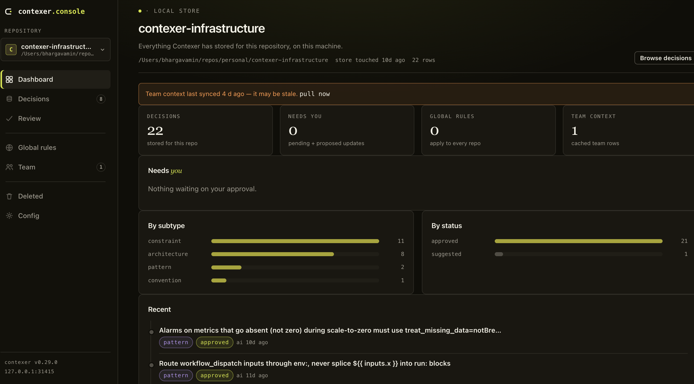

<p align="center">
  <a href="https://contexer.ai">
    <picture>
      <source media="(prefers-color-scheme: dark)" srcset="assets/logo-dark.svg">
      <source media="(prefers-color-scheme: light)" srcset="assets/logo-light.svg">
      
    </picture>
  </a>
</p>

<p align="center">
  <em>The engineering decision layer for AI coding agents.</em>
</p>

<p align="center">
  <a href="https://pypi.org/project/contexer/"></a>
  <a href="LICENSE"></a>
  <a href="https://www.python.org/"></a>
  <a href="https://github.com/bhargavamin/contexer/stargazers"></a>
  <a href="https://discord.gg/Fk6JSaW4p"></a>
</p>

<p align="center">
  <a href="#quick-start">Quick start</a> ·
  <a href="#what-contexer-gives-you-that-a-md-file-cant">Why not rule files?</a> ·
  <a href="#how-it-works">How it works</a> ·
  <a href="#decision-guardrails">Guardrails</a> ·
  <a href="#see-what-your-agents-are-being-told">Console</a> ·
  <a href="docs/benchmark.md">Benchmark</a> ·
  <a href="#documentation">Docs</a> ·
  <a href="https://discord.gg/Fk6JSaW4p">Discord</a>
</p>

<p align="center">
  <sub><strong>New:</strong> <a href="https://contexer.ai/teams">Contexer Personal Cloud &amp; Teams</a> — sync decisions across machines, share a team decision layer.</sub>
</p>

---

# Stop re-teaching your AI agents what you already decided.

You explained it Monday. Again Wednesday. On Friday the agent asks again — or quietly re-derives the answer from scratch, six turns at a time. Every AI coding session starts from zero, and the rules files you write to fix that go stale the moment an agent ships something new.

Contexer is the **decision layer**: it captures engineering decisions as you work, keeps them current as they change, and hands them to every agent — Claude Code, Cursor, Codex, Gemini CLI — **before it starts reasoning**. The settled answer arrives first; the agent stops re-exploring and just builds.

**Tuesday** — the agent writes a raw `fetch` call with a hand-rolled retry loop. You correct it:

> All HTTP goes through `lib/apiClient` — it already does auth refresh, backoff, and rate-limit headers. Hand-rolled retries are what took us down on Black Friday.

**Three weeks later** — fresh context, different feature, any of the four tools. Before the agent writes a line, Contexer injects:

> `[convention] All HTTP goes through lib/apiClient (auth refresh, backoff, rate-limit handling) — hand-rolled retries caused the Black Friday outage.`

It ships through `apiClient` on the first try. And when a teammate asks *"why can't I just use fetch here?"* — their agent answers with the real incident, not a guess.

Everything above is measured, not marketed: hundreds of live agent sessions, deterministic scoring, independent validation, negative findings published. **[Read the benchmark →](docs/benchmark.md)**

---

## The developer problem: re-teaching your agent every session

You know these moments:

- **"I've told it this three times."** You corrected the agent's mocking strategy Monday. It's Wednesday and the agent is mocking the DB layer again. → Contexer injects your conventions at session start, every session. Correct once, done forever.
- **"Why did we pick this?"** You ask about a decision made three weeks ago and the agent confidently guesses wrong from training data. → Ask "why did we choose Postgres?" and Contexer hands the agent the *actual stored decision* — with the reasoning — before it answers.
- **"Cursor doesn't know what Claude knows."** You switch tools and start re-teaching. → One decision layer, four agents. Capture in any of them; all of them know it.
- **"I maintain four rule files now."** CLAUDE.md for Claude, AGENTS.md for Codex, `.cursor/rules` for Cursor, GEMINI.md for Gemini — times every repo. You wrote them in January; the codebase moved on in February; now they quietly teach every agent things that are no longer true. → Zero files to maintain. Decisions are captured when they're made and updated when they change, in one store every tool reads.
- **"My context just got compacted."** Long session, context compression eats the decisions you fetched. → Contexer restores them automatically.

No workflow change. No prompt discipline. You code; directives like *"always use uv, never pip"* are captured automatically, and *"store that decision"* catches anything else. Everything stays in plain JSON on your machine.

## The leadership problem: your standards never reach the code

If you run an engineering team, your real problem isn't that AI writes bad code — it's that **AI writes code without knowing what your organization has decided**:

- **Standards that live in a wiki don't reach the code.** Your security rule — *"never log request data"*, *"no plaintext secrets"* — is documented, and violated, because no agent reads the wiki at the moment it writes the line. Contexer puts the rule in front of every agent, in every session, *before generation* — the leftmost shift there is.
- **Every senior engineer is a walking decision archive** — and those decisions leave in AI chat scrollback, Slack threads, and resignations. Contexer turns them into a versioned, human-approved, auditable asset: who decided what, when, and why.
- **Onboarding costs weeks of "ask the person who knows".** A new engineer's agent starts with the repo's full decision history from day one.
- **Multi-agent sprawl is already here.** Your team runs Claude Code *and* Cursor *and* Codex. Contexer is the one layer that keeps them all consistent — no single-vendor lock-in on your engineering knowledge.
- **Governance, not vibes.** Decisions are approved by humans, versioned with full history, and reviewable (`contexer review`). AI proposes; your engineers ratify. And Contexer steers rather than enforces — your CI and PR gates still verify; agents just stop violating the rules in the first place.

The open-source version is per-developer. **[Contexer Teams](https://contexer.ai)** (early access) makes it organizational: your platform or security team publishes a rule once, and every developer's agent starts with it — every repo, every tool, before the code is written.

---

## What Contexer gives you that a .md file can't

Every agent has its own rules file: CLAUDE.md (Claude Code), AGENTS.md (Codex), GEMINI.md (Gemini CLI), `.cursor/rules` (Cursor). A complete, up-to-date one is genuinely as token-efficient as Contexer — [we measured it](docs/benchmark.md). But each file serves only the tool that reads it, and all of them start incomplete and go stale. This is what you're actually buying:

| | Hand-written rules file (CLAUDE.md, AGENTS.md, GEMINI.md, `.cursor/rules`) | Contexer |
|---|---|---|
| Who writes it | You, by hand | Written for you: the repo is scanned and measured on first use; decisions are captured as you work |
| How many to maintain | One per tool, per repo — CLAUDE.md, AGENTS.md, `.cursor/rules`, GEMINI.md — and the copies drift apart | Zero files. One store serves every tool and repo |
| Who keeps it current | You. Nobody does — files decay | Every decision is stored the moment it's made, with the reasoning |
| When it's wrong or outdated | Silently misleads every session | Changes need your approval; full version history of every decision is kept |
| "Why did we build it this way?" | Answered only if someone wrote it down that day | The stored decision includes the reasoning, and the AI is handed it before answering |
| Which tools benefit | Only the tool that reads that file | Claude Code, Cursor, Codex, and Gemini CLI — one store, captured once, known everywhere |
| Long sessions | Knowledge the AI dug up is lost when the conversation is compressed | Restored automatically after compression |
| What it costs when nothing is relevant | The whole file is loaded every session regardless | Nothing loads except your always-on rules (~26 tokens each); lookups add milliseconds |
| Your team | Everyone maintains their own copy | One shared, approved source across the team (Teams, early access) |

---

## Quick start

Requires **Python 3.12+** and **[uv](https://docs.astral.sh/uv/getting-started/installation/)**. Under two minutes.

```bash
uv tool install contexer   # 1. install
contexer install           # 2. wire into your AI assistants
```

`contexer install` auto-detects Claude Code, Cursor, Codex, and Gemini CLI, and wires everything it finds. Restart your assistant, open any git repo — on first use, Contexer analyzes the repo and proposes its starting knowledge. It runs silently from there.

Details: **[installation & verification](docs/install.md)** · **[per-tool integration notes](docs/integrations.md)**

---

## How it works

Contexer captures four kinds of engineering knowledge — **constraints** ("never merge untested code"), **conventions** ("uv, not pip"), **architecture decisions** ("REST over GraphQL, here's why"), and **patterns** — and replays them at the right moment: rules load at session start; architecture and rationale are fetched on demand the instant a question needs them.

You drive it in plain English:

```
"save this as a convention: always use uv not pip"
"what decisions did we make about postgres?"
"store that globally: conventional commits everywhere"
```

Trust is explicit: AI-*proposed* decisions are held for your review (`contexer review`) and never reach a session until you approve them. Approved decisions are versioned — history preserved, latest approved revision replayed. Cost is flat and tiny (roughly 26 tokens per rule at session start, nothing on unrelated prompts).

Deep dive: **[how it works](docs/how-it-works.md)** · **[day-to-day usage & CLI](docs/usage.md)**

### Honest limits

Capture beyond outright directives is best-effort (the *"store that decision"* escape hatch exists for a reason); Cursor's hook model limits per-prompt injection there; the OSS store is per-developer, not shared. Full list, published on purpose: **[limitations](docs/usage.md#limitations-read-this--we-publish-them-on-purpose)**.

---

## Decision guardrails

Contexer doesn't just hand your agent the rules — `contexer guard` checks staged changes against them at commit time.

```bash
contexer guard --install-hook   # wires .git/hooks/pre-commit for this repo (opt-in, not run by `install`)
```

By default it only warns: an approved decision — never a bare AI guess — that mentions a staged file surfaces as a reminder before the commit lands, and the commit still goes through.

Want it to actually block a bad commit? Arm any approved decision as a machine-checkable rule (`contexer guard arm <id> --regex '<pattern>'` or `--check secret`) and it fails the commit if violated. Only rules you explicitly arm can block anything.

GUI commit flows (VS Code, Cursor, and similar) run the hook but only surface a blocked commit — the warning-only reminders are terminal output a graphical commit panel won't show you.

The guard fails open (any internal error, or a run over budget, skips checks rather than blocking your commit) and can be bypassed per-commit with `CONTEXER_GUARD=0 git commit …`, same as any pre-commit hook is bypassed with `--no-verify`. It's a local nudge, not a substitute for CI — your pipeline's checks are the backstop that can't be skipped from a developer's machine.

Details: **[mechanism](docs/how-it-works.md#commit-time-guard)** · **[CLI reference](docs/usage.md#commit-time-guard)**

---

## See what your agents are being told

```bash
contexer ui --open
```

A local web console over **every repo on your machine**, not just the one you're in — because "what does my agent actually know?" is a question you shouldn't have to answer by reading JSON.

<p align="center">
  
</p>

- **Read it, then fix it.** Browse and search every stored decision with its full revision history. Edit one — history is kept, nothing is overwritten. Delete one for good: a delete sticks, instead of quietly reappearing next session from a memory file or a mined conversation. Restore it if you change your mind.
- **See the whole review queue at once**, not one terminal prompt at a time — what's pending, and proposed changes to decisions you already approved shown as before/after diffs. The graphical counterpart to `contexer review`.
- **The whole picture.** Per-repo dashboard, global rules, cached team context, deleted decisions, and your settings — one switcher, seven views.

It binds `127.0.0.1`, every route is authenticated, and the server itself never reaches the network. It is also **off until you ask for it**: `contexer ui` starts it on demand, and the printed link is short-lived on purpose. Set `[ui] autostart = true` and every session start hands you the URL for the repo you just opened.

Details, the `[ui]` settings, and the security model: **[the local console](docs/ui.md)**

---

## Documentation

| | |
|---|---|
| **[Installation](docs/install.md)** | Install, verify, update, uninstall |
| **[Integrations](docs/integrations.md)** | Claude Code, Cursor, Codex, Gemini CLI — wiring and parity notes |
| **[How it works](docs/how-it-works.md)** | Capture, bootstrap, session injection, review/versioning, cost, privacy |
| **[Usage & CLI](docs/usage.md)** | Natural-language commands, CLI reference, teams login, troubleshooting, limitations |
| **[Local console](docs/ui.md)** | `contexer ui`, the seven views, `[ui]` settings, security model |
| **[Benchmark](docs/benchmark.md)** | Live-session A/B methodology, findings (including negative ones), raw data |

---


## Contributing

Bug reports, fixes, and documentation improvements are welcome. See **[CONTRIBUTING.md](CONTRIBUTING.md)** for setup, code style, and the PR process. Questions or ideas? Join the community on [Discord](https://discord.gg/Fk6JSaW4p).

## License

MIT. See [LICENSE](LICENSE) for full terms.

The Contexer name and logo are trademarks of Contexer.ai. The MIT license does not grant rights to use the Contexer name, logo, or brand in any way that implies official affiliation.

---

Contexer is **not a chat memory tool**. It is **the engineering decision layer for AI coding agents** — capturing architecture decisions, constraints, conventions, and patterns so engineering knowledge becomes a shared organizational asset instead of disappearing inside AI conversations.
